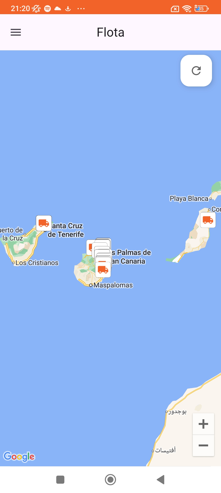
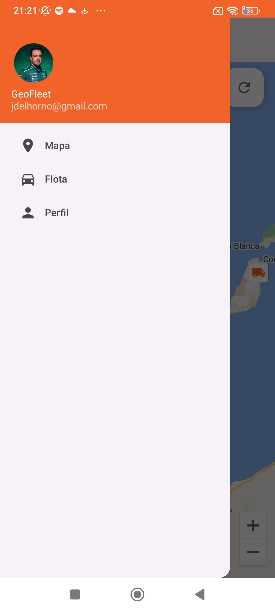
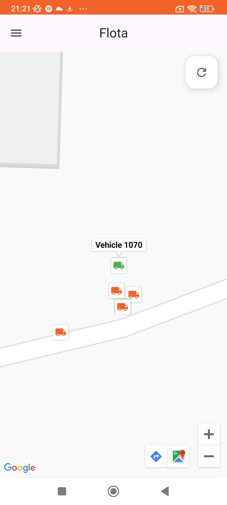
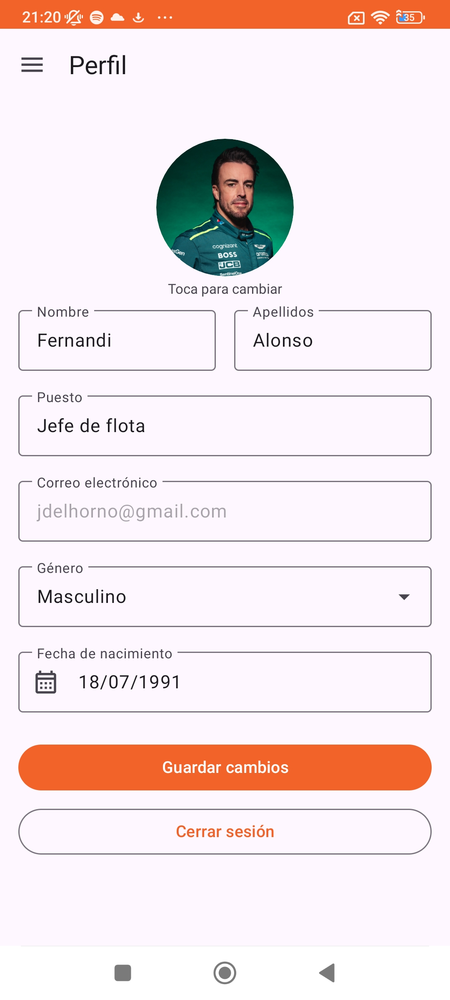
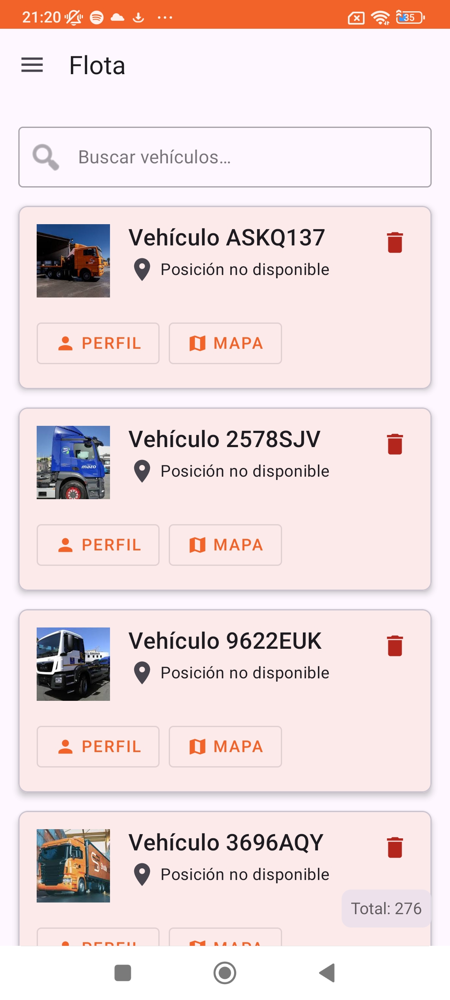
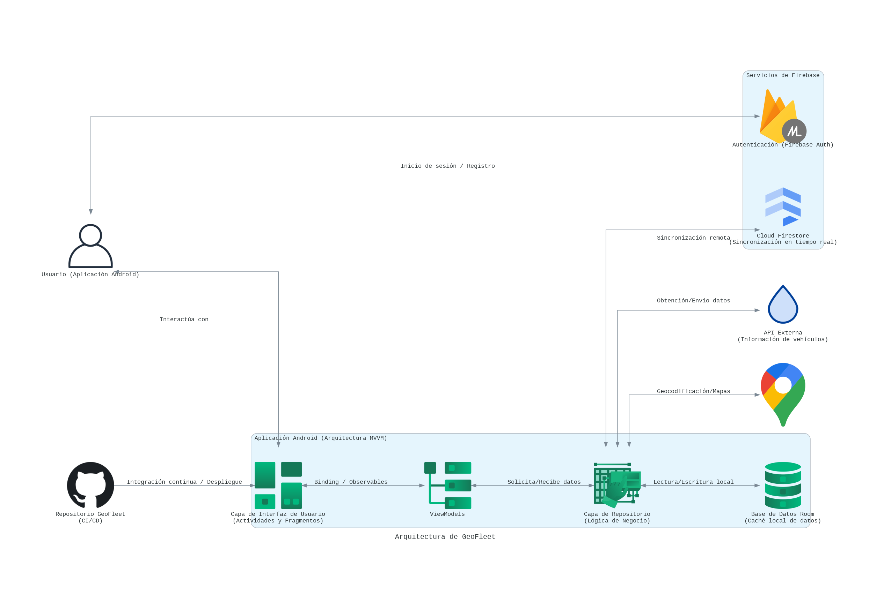
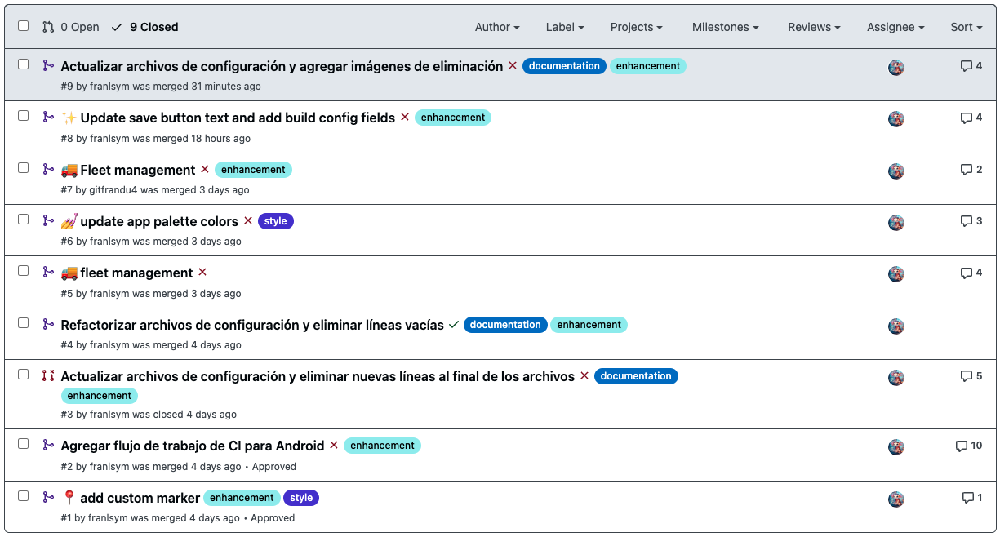
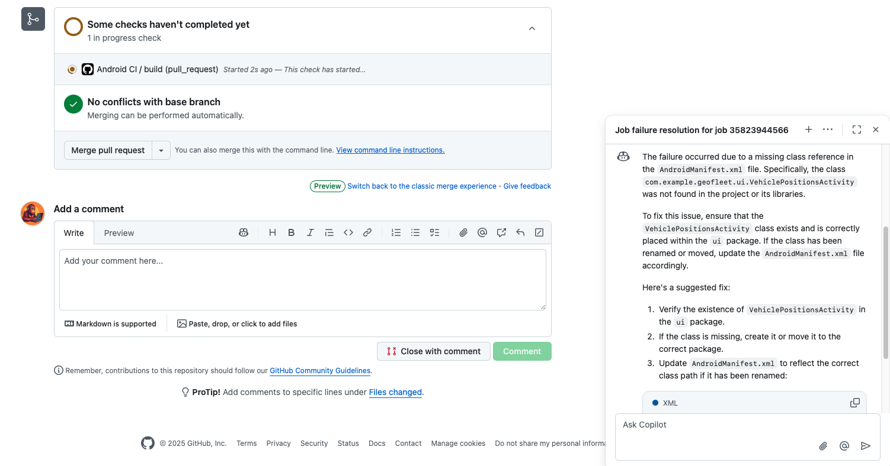
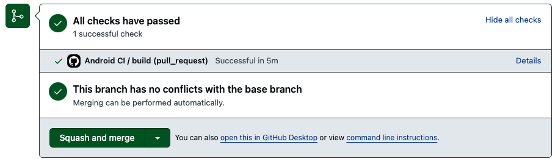

# GeoFleet - Sistema de Monitoreo de Flotas


## Índice

- [GeoFleet - Sistema de Monitoreo de Flotas](#geofleet---sistema-de-monitoreo-de-flotas)
  - [Índice](#índice)
  - [Introducción](#introducción)
  - [Objetivos](#objetivos)
  - [Vistas de la Aplicación](#vistas-de-la-aplicación)
  - [Arquitectura](#arquitectura)
    - [Patrones de Diseño](#patrones-de-diseño)
  - [Funcionalidades](#funcionalidades)
    - [Implementadas](#implementadas)
    - [Funcionalidades Futuras](#funcionalidades-futuras)
  - [Tecnologías Utilizadas](#tecnologías-utilizadas)
  - [Estructura del Proyecto](#estructura-del-proyecto)
  - [Requisitos Previos](#requisitos-previos)
  - [Configuración Técnica](#configuración-técnica)
    - [1. Firebase](#1-firebase)
    - [2. Google Maps](#2-google-maps)
    - [3. Gradle](#3-gradle)
  - [Base de Datos Local y Sincronización](#base-de-datos-local-y-sincronización)
    - [Estructura de Datos](#estructura-de-datos)
    - [Flujo de Datos](#flujo-de-datos)
  - [Detalles Técnicos Destacados](#detalles-técnicos-destacados)
    - [Integración de Mapas](#integración-de-mapas)
    - [Gestión de Perfiles](#gestión-de-perfiles)
  - [Instrucciones para Ejecutar](#instrucciones-para-ejecutar)
  - [Configuración](#configuración)
    - [Archivo config.properties](#archivo-configproperties)
    - [Autenticación](#autenticación)
    - [Funcionalidades Principales](#funcionalidades-principales)
      - [Monitoreo de Vehículos](#monitoreo-de-vehículos)
      - [Interfaz de Usuario](#interfaz-de-usuario)
  - [CI/CD y Automatización](#cicd-y-automatización)
    - [Pull Requests y Code Review](#pull-requests-y-code-review)
    - [Integración con GitHub AI](#integración-con-github-ai)
    - [Flujo de Trabajo de CI](#flujo-de-trabajo-de-ci)
    - [Comandos de AI en Pull Requests](#comandos-de-ai-en-pull-requests)
    - [Beneficios de la Integración](#beneficios-de-la-integración)
  - [Conclusiones](#conclusiones)

---

## Introducción

**GeoFleet** es una aplicación **Android nativa** desarrollada en **Kotlin** que permite **monitorear y gestionar flotas de vehículos** en tiempo real. Combina:
- **Firebase** (Authentication, Firestore, Storage)
- **Google Maps**
- **Room Database** (para soporte offline)

Su finalidad es brindar una **vista centralizada** de la ubicación de cada vehículo, con actualizaciones en tiempo real y funciones complementarias como **gestión de perfiles**, **persistencia local**, y **sincronización de datos**.

---

## Objetivos

1. **Monitoreo en Tiempo Real**  
   - Actualizar la posición de la flota automáticamente con **Google Maps** y **Firestore**.

2. **Gestión Eficiente de Datos**  
   - Implementar **Room** para trabajar offline y sincronizar con Firebase Firestore cuando haya conexión.

3. **Escalabilidad y Extensibilidad**  
   - Usar arquitectura **Clean** y el patrón **MVVM**, de forma modular, para facilitar la adición de nuevas funciones.

4. **Seguridad y Privacidad**  
   - Integrar **Firebase Authentication** para el control de acceso de usuarios y proteger datos sensibles.

5. **Experiencia de Usuario Óptima**  
   - Implementar **Material Design 3** ofreciendo una interfaz amigable, limpia y adaptable a distintos dispositivos.

---

## Vistas de la Aplicación

Aquí se presentan algunas capturas de pantalla de la aplicación **GeoFleet**, mostrando diferentes funcionalidades y vistas.

| Vista de Mapa | Menú de Navegación | Detalle de Vehículo |
|:-------------:|:------------------:|:-------------------:|
|  |  |  |

| Vista de Perfil | Lista de Vehículos | Perfil de Vehículo |
|:---------------:|:------------------:|:-------------------:|
|  |  |  |

Estas capturas ilustran la interfaz de usuario y las funcionalidades clave de la aplicación, como la visualización de mapas.

Nota: La información de posición no está disponible en la captura de la lista de vehículos de manera intencional.

---

## Arquitectura



La arquitectura de **GeoFleet** está diseñada para maximizar la eficiencia y escalabilidad, utilizando un enfoque modular basado en el patrón **MVVM** (Model-View-ViewModel). La aplicación se compone de las siguientes capas:

1. **Capa de Interfaz de Usuario (UI)**: 
   - Incluye actividades y fragmentos que interactúan directamente con el usuario.
   - Utiliza **Binding** y **Observables** para mantener la UI sincronizada con los datos.

2. **ViewModels**:
   - Actúan como intermediarios entre la UI y la capa de datos.
   - Gestionan la lógica de presentación y el estado de la aplicación.

3. **Capa de Repositorio**:
   - Encapsula la lógica de negocio y maneja la obtención y almacenamiento de datos.
   - Interactúa con fuentes de datos locales (Room Database) y remotas (Firebase, APIs externas).

4. **Servicios de Firebase**:
   - Proporcionan autenticación y sincronización en tiempo real a través de **Cloud Firestore**.

5. **Integración Continua y Despliegue**:
   - Utiliza GitHub Actions para automatizar la integración y despliegue continuo, asegurando que el código se mantenga en alta calidad.

### Patrones de Diseño

- **Repository Pattern**:
  - Proporciona una abstracción sobre las fuentes de datos, permitiendo cambiar la implementación sin afectar otras partes del código.

- **Observer Pattern** (LiveData/Flow):
  - Permite que los componentes de la UI observen cambios en los datos y se actualicen automáticamente, mejorando la reactividad y la eficiencia.

- **SOLID**:
  - Principios de diseño que aseguran que el código sea fácil de mantener y extender. Incluyen:
    - **S**ingle Responsibility: Cada clase tiene una única responsabilidad.
    - **O**pen/Closed: Las clases están abiertas a extensión pero cerradas a modificación.
    - **L**iskov Substitution: Las clases derivadas deben ser sustituibles por sus clases base.
    - **I**nterface Segregation: Las interfaces deben ser específicas y no forzar a implementar métodos innecesarios.
    - **D**ependency Inversion: Las dependencias deben basarse en abstracciones, no en concreciones.

Esta arquitectura permite que **GeoFleet** sea una aplicación robusta, flexible y fácil de mantener, preparada para futuras expansiones y mejoras.


## Funcionalidades

### Implementadas

- **Login (Autenticación de Usuarios)**  
  Los usuarios pueden registrarse e iniciar sesión de forma segura utilizando Firebase Authentication.

- **🗺️ Mapa en Tiempo Real**  
  Visualización de la ubicación actual de los vehículos en un mapa interactivo mediante Google Maps SDK.

- **📋 Listado de Vehículos**  
  - Lista de vehículos con información como alias, matrícula, estado, tipo de vehículo, etc.
  - Posibilidad de complementar y editar información no presente en la base de datos original, guardándola en Firebase.

- **📱 Detalles del Vehículo**  
  Información detallada de cada vehículo, accesible desde el listado.

- **🔄 Sincronización en Tiempo Real**  
  Integración con Firebase Firestore para actualizaciones instantáneas.

- **💾 Modo Offline**  
  Acceso a información básica de la aplicación sin conexión a internet, utilizando Room Database.

### Funcionalidades Futuras

- **🔔 Notificaciones Push**  
  Envío de notificaciones sobre eventos relevantes (por definir según las necesidades).

- **📊 Análisis de Datos**  
  Visualización de estadísticas y datos relevantes sobre el uso y rendimiento de los vehículos.

- **🗺️ Histórico de Rutas**  
  Visualización de las rutas recorridas por los vehículos, con filtros de fecha y hora.

- **📍 Compartir Ubicación**  
  Permitir al usuario compartir la ubicación de un vehículo con otros usuarios.

Estas funcionalidades futuras están planificadas para mejorar la experiencia del usuario y ofrecer un conjunto más completo de herramientas para la gestión de flotas.

---

## Tecnologías Utilizadas

En el desarrollo de **GeoFleet**, se han empleado las siguientes herramientas y frameworks:

- **Kotlin**  
  Lenguaje oficial para el desarrollo de aplicaciones Android, que destaca por su seguridad (programación null-safe) y su concisión.

- **Firebase (Authentication, Firestore, Storage)**  
  Plataforma de Google que provee autenticación de usuarios, base de datos en tiempo real y almacenamiento de archivos. Permite la sincronización automática de datos y simplifica la gestión de usuarios.

- **Google Maps SDK**  
  Biblioteca nativa de Google para la integración de mapas interactivos, soporte de marcadores personalizados y localización.  

- **Jetpack Components**  
  Conjunto de librerías de Android que incluye:
  - **Room**: Persistencia local de datos y consultas reactivas.  
  - **Navigation**: Manejo de la navegación entre pantallas.  
  - **ViewModel, LiveData**: Separación de lógica de negocio y supervisión de cambios.  
  - **ViewBinding**: Conexión segura entre vistas y código, evitando errores de tipo.

- **Coroutines & Flow**  
  Librerías de Kotlin que facilitan la programación asíncrona y el manejo reactivo de datos, respetando el principio de no bloquear la interfaz de usuario.

- **Material Design 3**  
  Lineamientos de diseño de Google que garantizan consistencia visual, adaptabilidad en múltiples dispositivos y uso de componentes accesibles.

- **Retrofit & OkHttp** 
  Permiten, en caso de necesitarlo, la comunicación con APIs externas mediante peticiones HTTP, brindando un manejo sencillo de respuestas en formato JSON o XML.

- **Glide**  
  Librería para la carga y gestión eficiente de imágenes. Permite transformaciones sencillas —como recortes circulares— y almacenamiento en caché.

---

## Estructura del Proyecto

La estructura de directorios de **GeoFleet** refleja la separación lógica de capas y funcionalidades, favoreciendo la escalabilidad y el mantenimiento:

```
GeoFleet/
├── app/
│   ├── src/
│   │   ├── main/
│   │   │   ├── java/com/example/geofleet/
│   │   │   │   ├── data/          # Modelos, DAO y repositorios
│   │   │   │   ├── ui/            # Activities y Fragments (Vistas)
│   │   │   │   ├── service/       # Servicios Firebase y lógica de negocio
│   │   │   │   └── utils/         # Utilidades y extensiones comunes
│   │   ├── res/                   # Recursos XML (layouts, drawables, strings)
│   │   ├── AndroidManifest.xml    # Configuración de permisos y actividades
├── build.gradle                   # Configuración de dependencias y plugins
├── docs/                          # Documentación técnica y archivos de soporte
└── proguard-rules.pro             # Configuración de optimización y minificación
```

1.	**`data/`**: Contiene los modelos de datos, las interfaces DAO de Room y los repositorios que conectan las fuentes de datos locales y remotas.

2.	**`ui/`**: Incluye las Activities y Fragments que representan la capa de presentación. Se integran con ViewModels para manejar la lógica de la aplicación.

3.	**`service/`**: Alberga clases y funciones que interactúan con servicios externos (p. ej. Firebase), gestionando la autenticación y la sincronización en tiempo real.

4.	**`utils/`**: Agrupa utilidades y extensiones usadas en toda la aplicación (métodos de formateo, funciones de extensión, etc.).

---

## Requisitos Previos

Antes de compilar y ejecutar el proyecto, se deben cumplir los siguientes requisitos:

- **Software**  
  - Android Studio (Arctic Fox o superior)  
  - JDK 8+  
  - Google Play Services  

- **Servicios**  
  - [Cuenta Firebase](https://console.firebase.google.com/) con Authentication, Firestore y Storage activos.
  - API Key de Google Maps obtenida desde [Google Cloud Console](https://console.cloud.google.com/).

---

## Configuración Técnica

La aplicación requiere ajustar algunos archivos clave y habilitar servicios externos:

### 1. Firebase

1. Crear un proyecto en la [Firebase Console](https://console.firebase.google.com/).  
2. Descargar `google-services.json` y colocarlo en la carpeta `app/`.  
3. Habilitar:
   - **Authentication** (para control de acceso)  
   - **Firestore** (para almacenar y sincronizar datos)  
   - **Storage** (para almacenar imágenes)  

### 2. Google Maps

1. Obtener la API Key desde [Google Cloud Console](https://console.cloud.google.com/).  
2. Agregarla a `local.properties`:
   ```
   MAPS_API_KEY=tu_api_key_aqui
   ```

### 3. Gradle

En el archivo `build.gradle` (a nivel de módulo), verifica que estén declarados los plugins y dependencias requeridos:

```groovy
plugins {
    id 'com.android.application'
    id 'kotlin-android'
    id 'com.google.gms.google-services'
}

android {
    // Configuración específica del proyecto
    // ...
}

dependencies {
    implementation platform('com.google.firebase:firebase-bom:33.7.0')
    implementation 'com.google.firebase:firebase-auth'
    implementation 'com.google.firebase:firebase-firestore'
    implementation 'com.google.firebase:firebase-storage'
    implementation 'com.google.android.gms:play-services-maps:18.2.0'

    // Jetpack & UI
    implementation 'com.google.android.material:material:1.11.0'
    implementation 'androidx.appcompat:appcompat:1.6.1'

    // Glide
    implementation 'com.github.bumptech.glide:glide:4.16.0'
    implementation 'androidx.room:room-runtime:2.6.1'
    kapt 'androidx.room:room-compiler:2.6.1'

    // (Opcional) Retrofit & OkHttp
    implementation 'com.squareup.retrofit2:retrofit:2.9.0'
    implementation 'com.squareup.okhttp3:okhttp:4.10.0'
}
```

---

## Base de Datos Local y Sincronización

Para asegurar la disponibilidad de datos incluso en condiciones de conectividad inestable, **GeoFleet** implementa una estrategia de sincronización basada en **Room** (offline) y **Firestore** (online).

### Estructura de Datos
```kotlin
@Entity(tableName = "vehicle_positions")
data class VehiclePositionEntity(
    @PrimaryKey val vehicleId: String,
    val latitude: Double,
    val longitude: Double,
    val timestamp: Long = System.currentTimeMillis()
)
```

### Flujo de Datos

1. **Carga Inicial**

- Se obtienen los IDs de los vehículos desde la configuración.
- Se solicitan las posiciones iniciales a través de la API y se guardan en Room.
- Los cambios se reflejan en Firestore para mantener sincronizados a todos los clientes y permitir acceso remoto.

2. **Actualizaciones**

- La aplicación detecta nuevas posiciones, cancelando cualquier trabajo en curso para evitar duplicidades.
- Los datos actualizados se almacenan tanto en Room como en Firestore, y la interfaz de usuario se refresca mediante LiveData.

Esta implementación "offline first" garantiza la operatividad de la aplicación aun sin conexión a internet, volcando luego los datos a la nube cuando la conectividad se restablezca.

---

## Detalles Técnicos Destacados

### Integración de Mapas

- Uso del **Google Maps SDK** para renderizar y actualizar mapas de forma dinámica.
- **Marcadores Personalizados**: Se emplean layouts inflados en tiempo de ejecución para crear íconos con información adicional (p. ej. estado del vehículo).
- **Actualizaciones en Tiempo Real**: Se implementa un ciclo de actualización periódica con corrutinas para mantener la información actualizada.

  ```kotlin
  fun createCustomMarker(): BitmapDescriptor {
      val view = LayoutInflater.from(context).inflate(R.layout.marker_layout, null)
      val bitmap = Bitmap.createBitmap(view.width, view.height, Bitmap.Config.ARGB_8888)
      view.draw(Canvas(bitmap))
      return BitmapDescriptorFactory.fromBitmap(bitmap)
  }
  ```

### Gestión de Perfiles

- **Uso de Firebase Storage**: Permite asociar fotos personalizadas a cada usuario o vehículo.
- **Glide**: Facilita la carga y transformación de imágenes (p. ej. para recortar avatares en forma circular):

  ```kotlin
  Glide.with(this)
      .load(photoUrl)
      .circleCrop()
      .placeholder(R.drawable.ic_person_placeholder)
      .error(R.drawable.ic_person_error)
      .into(this)
  ```

---

## Instrucciones para Ejecutar

Siga estos pasos para desplegar la aplicación en un emulador o dispositivo físico:

1. **Clona el repositorio**:
   ```
   git clone https://github.com/gitfrandu4/geofleet.git
   ```
2. **Abre el proyecto en Android Studio**.
3. **Configura** `google-services.json` y **MAPS_API_KEY** en `local.properties`.
4. **Compila y ejecuta** en emulador o dispositivo.

---

## Configuración

### Archivo config.properties

```
# URL base de la API
BASE_URL=https://api.example.com/

# IDs de vehículos a monitorear
vehicle.ids=0001,0002,0003,0004,0005,0006,0007,0008,0009,0010

# Token de autenticación para la API
API_TOKEN=your_api_token
```

### Autenticación

- Se requiere **Firebase Authentication** para acceso a la app.  
- Para llamadas a APIs externas, se usa un token Bearer definido en `config.properties`.

### Funcionalidades Principales

#### Monitoreo de Vehículos
- Visualiza en tiempo real las posiciones.  
- Soporta actualización manual con un FAB o menú.  
- Filtra coordenadas inválidas y persiste localmente la información.  

#### Interfaz de Usuario
- Navegación con un **Navigation Drawer** o **Bottom Navigation** (dependiendo de la configuración).  
- Alertas (Snackbars, Toasts) y reintentos en caso de errores.  
- Diseño moderno con **Material Design 3**.

---

## CI/CD y Automatización

El proyecto implementa un sistema completo de CI/CD usando GitHub Actions en combinación con GitHub AI para mejorar continuamente la calidad del código.

### Pull Requests y Code Review

Vista general de los Pull Requests del proyecto mostrando el estado, etiquetas y revisiones



Como se puede observar en la imagen, los Pull Requests están organizados con:
- **Etiquetas específicas**: 
  - `enhancement`: Para mejoras y nuevas características
  - `documentation`: Para cambios en la documentación
  - `style`: Para cambios en el diseño y UI


Los Pull Requests en el proyecto siguen un flujo de trabajo estructurado:
- Revisión automática por GitHub AI
- Code review por parte del equipo (AI)
- Verificación de estándares de código (linting)
- Generación de APK de debug

Además, si estuvieramos en una etapa de desarrollo, se podría desplegar a Firebase App Distribution.

### Integración con GitHub AI


### Flujo de Trabajo de CI


### Comandos de AI en Pull Requests
Los desarrolladores pueden utilizar comandos especiales en los comentarios:
- `/review` - Solicita una revisión técnica detallada
- `/summary` - Genera un resumen técnico del cambio
- `/suggest` - Obtiene sugerencias de mejora específicas

### Beneficios de la Integración
- **Mejora Continua**: Cada PR recibe feedback automático para mejorar la calidad del código
- **Aprendizaje Activo**: Los desarrolladores reciben sugerencias educativas sobre mejores prácticas
- **Detección Temprana**: Los problemas se identifican y corrigen antes de llegar a la rama principal
- **Consistencia**: Asegura que todo el código siga los mismos estándares de calidad

---

## Conclusiones

El desarrollo de **GeoFleet** ha supuesto un hito formativo al transitar desde el desarrollo web hacia un entorno de aplicaciones móviles Android nativas. A lo largo de esta experiencia, se han afrontado desafíos técnicos, aprovechado herramientas avanzadas y consolidado buenas prácticas que han dado como resultado un producto de calidad. A continuación, se resumen los aspectos más destacados:

1. **Desafíos de Integración**  
   La transición desde el desarrollo web al ecosistema Android requirió una fase de aprendizaje sustancial, especialmente en la optimización de la interfaz para múltiples dispositivos y la correcta gestión de permisos nativos. Sin embargo, la adopción de servicios integrados como **Firebase** y **Google Maps** aportó la solidez necesaria para implementar funcionalidades clave.

2. **Satisfacción con el Resultado**  
   El enfoque nativo en **Kotlin** y **Jetpack** permitió un mayor aprovechamiento de las capacidades del dispositivo, brindando una experiencia de usuario ágil y fluida. El soporte offline mediante **Room** y la sincronización en tiempo real con **Firestore** añaden un valor diferencial, particularmente útil en entornos con cobertura limitada.

3. **Rol de la Inteligencia Artificial**  
   La inclusión de herramientas de IA —**Cursor**, **OpenAI** y **Copilot**— agilizó la producción y revisión del código, fomentando mejoras continuas en la calidad. Además, la integración con GitHub Actions posibilitó un sistema de **CI/CD** inteligente que detecta y corrige problemas de forma temprana.

4. **Ventajas del Enfoque Nativo**  
   Alinear el desarrollo con las tecnologías oficiales de Android no solo facilitó la integración de APIs como Google Maps, sino que también permitió un diseño coherente y moderno bajo los lineamientos de **Material Design**. Esto garantiza una interfaz visualmente consistente y una base sólida para futuras extensiones.

5. **Arquitectura Limpia y MVVM**  
   El uso de **Clean Architecture** y MVVM propicia una separación clara de responsabilidades, lo que facilita la escalabilidad y el mantenimiento. El patrón de repositorios hace posible modificar o ampliar la capa de datos (por ejemplo, cambiando de backend) con un impacto mínimo en la UI.

6. **Estrategia Offline First**  
   Mediante **Room Database**, la aplicación sigue operativa en ausencia de internet, un factor crucial para el monitoreo y la logística de flotas en áreas de conectividad limitada. Esta característica mejora la confiabilidad y reduce el riesgo de pérdida de datos.

7. **Optimización de Rendimiento**  
   Las **Coroutines** de Kotlin resultaron imprescindibles para gestionar tareas asíncronas sin bloquear la interfaz, contribuyendo a una navegación fluida incluso en operaciones que exigen un gran volumen de datos o interacción constante con el servidor.

8. **Perspectivas de Futuro**  
   El proyecto cuenta con una arquitectura apta para la incorporación de nuevas APIs (por ejemplo, servicios de clima o tráfico) y la implementación de mejoras visuales —como la **clusterización de marcadores**— para la gestión de grandes volúmenes de información.

En definitiva, **GeoFleet** se consolida como una solución robusta y escalable que ha servido de plataforma de aprendizaje para explorar el desarrollo nativo, la integración de servicios de terceros y el uso de IA en el ciclo de vida del proyecto. El camino recorrido sienta las bases para seguir evolucionando la aplicación y explotando nuevos horizontes funcionales en la gestión de flotas.
