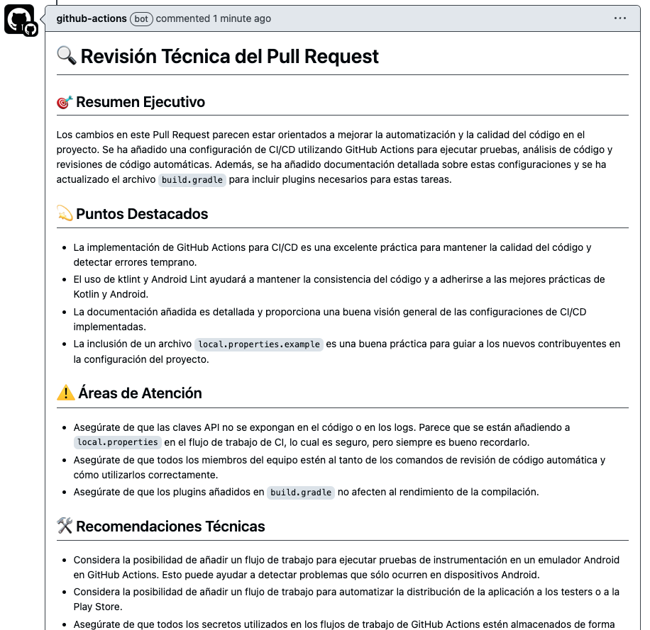
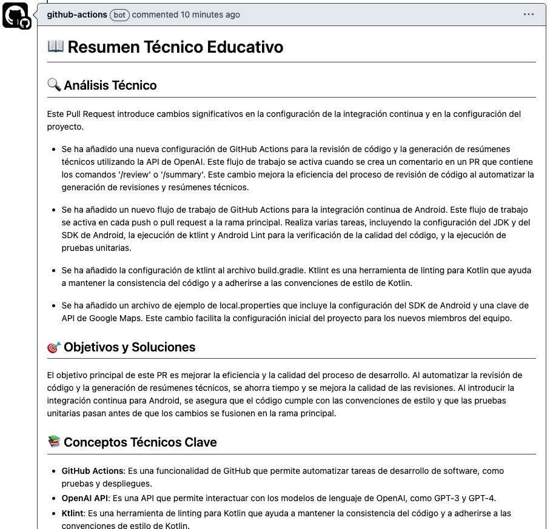

# GeoFleet - Sistema de Monitoreo de Flotas

## Descripción
GeoFleet es una aplicación Android desarrollada en Kotlin que permite monitorear y gestionar flotas de vehículos en tiempo real. Combina tecnologías modernas como Firebase y Google Maps para proporcionar una experiencia fluida y eficaz.

## Funcionalidades Clave
- 🗺️ **Mapa en Tiempo Real**: Visualización dinámica de las posiciones de los vehículos.
- 💾 **Base de Datos Local**: Uso de Room Database para almacenamiento offline.
- 🔄 **Sincronización en Tiempo Real**: Integración con Firebase Firestore.
- 📱 **Gestión de Perfiles**: Subida y manejo de imágenes con Firebase Storage.
- 🌐 **Interfaz Moderna**: Basada en Material Design 3.

## Tecnologías Utilizadas
- Kotlin
- Firebase:
  - Authentication
  - Firestore
  - Storage
- Google Maps SDK
- Jetpack Components:
  - Room Database
  - Navigation Component
  - ViewModel & LiveData
  - ViewBinding
- Coroutines & Flow
- Material Design 3
- Retrofit & OkHttp
- Glide para carga de imágenes

## Estructura del Proyecto
```
GeoFleet/
├── app/
│   ├── src/
│   │   ├── main/
│   │   │   ├── java/com/example/geofleet/
│   │   │   │   ├── data/          # Modelos, DAO y repositorios
│   │   │   │   ├── ui/            # Actividades y Fragments
│   │   │   │   ├── service/       # Servicios Firebase
│   │   │   │   └── utils/         # Utilidades comunes
│   │   ├── res/                   # Recursos XML (layouts, drawables, strings)
│   │   ├── AndroidManifest.xml    # Configuración de permisos y actividades
├── build.gradle                   # Configuración de dependencias
├── docs/                          # Documentación técnica
└── proguard-rules.pro             # Configuración de optimización
```

## Requisitos Previos
- **Software**:
  - Android Studio (versión Arctic Fox o superior).
  - JDK 8+.
  - Google Play Services.
- **Servicios**:
  - Cuenta Firebase con Authentication, Firestore y Storage habilitados.
  - API Key de Google Maps.

## Configuración Técnica

### Firebase
1. Crear un proyecto en [Firebase Console](https://console.firebase.google.com/).
2. Descargar el archivo `google-services.json` y colocarlo en la carpeta `app/`.
3. Habilitar los servicios necesarios:
   - **Authentication**: Para gestionar sesiones de usuario.
   - **Firestore**: Para almacenar posiciones y datos del usuario.
   - **Storage**: Para gestionar imágenes de perfil.

### Google Maps
1. Obtener la API Key desde [Google Cloud Console](https://console.cloud.google.com/).
2. Agregarla al archivo `local.properties`:
```
MAPS_API_KEY=tu_api_key_aqui
```

### Gradle
Configurar dependencias en `build.gradle`:
```
plugins {
    id 'com.android.application'
    id 'kotlin-android'
    id 'com.google.gms.google-services'
}

dependencies {
    // Firebase
    implementation platform('com.google.firebase:firebase-bom:33.7.0')
    implementation 'com.google.firebase:firebase-auth'
    implementation 'com.google.firebase:firebase-firestore'
    implementation 'com.google.firebase:firebase-storage'

    // Google Maps
    implementation 'com.google.android.gms:play-services-maps:18.2.0'

    // UI
    implementation 'com.google.android.material:material:1.11.0'
    implementation 'androidx.appcompat:appcompat:1.6.1'

    // Glide
    implementation 'com.github.bumptech.glide:glide:4.16.0'

    // Room
    implementation 'androidx.room:room-runtime:2.6.1'
    kapt 'androidx.room:room-compiler:2.6.1'
}
```

### Base de Datos
Modelo `VehiclePositionEntity`:
```
@Entity(tableName = "vehicle_positions")
data class VehiclePositionEntity(
    @PrimaryKey val vehicleId: String,
    val latitude: Double,
    val longitude: Double,
    val timestamp: Long = System.currentTimeMillis()
)
```

DAO:
```
@Dao
interface VehiclePositionDao {
    @Insert(onConflict = OnConflictStrategy.REPLACE)
    suspend fun insertAll(positions: List<VehiclePositionEntity>)

    @Query("SELECT * FROM vehicle_positions ORDER BY timestamp DESC")
    fun getAllPositions(): Flow<List<VehiclePositionEntity>>
}
```

## Detalles Técnicos Destacados

### Integración de Mapas
- Uso de Google Maps SDK.
- Marcadores personalizados generados dinámicamente:
```
fun createCustomMarker(): BitmapDescriptor {
    val view = LayoutInflater.from(context).inflate(R.layout.marker_layout, null)
    val bitmap = Bitmap.createBitmap(view.width, view.height, Bitmap.Config.ARGB_8888)
    view.draw(Canvas(bitmap))
    return BitmapDescriptorFactory.fromBitmap(bitmap)
}
```

### Sincronización de Datos
- **Firestore**: Proporciona datos en tiempo real.
- **Room Database**: Cachea datos localmente para soporte offline.

### Gestión de Perfiles
Componente `ProfileImageView`:
```
class ProfileImageView : AppCompatImageView {
    init {
        setImageResource(R.drawable.ic_person_placeholder)
        loadProfileImage()
    }

    private fun loadProfileImage() {
        Glide.with(this)
            .load(photoUrl)
            .circleCrop()
            .placeholder(R.drawable.ic_person_placeholder)
            .error(R.drawable.ic_person_error)
            .into(this)
    }
}
```

## Funcionalidades Futuras
1. **Clustering**: Agrupar marcadores en áreas densas.
2. **Filtros**: Mostrar vehículos por estado o ubicación.
3. **Estado del Vehículo**: Colores de marcadores según disponibilidad.

## Instrucciones para Ejecutar
1. **Clonar el repositorio**:
```
git clone https://github.com/gitfrandu4/geofleet.git
```
2. **Abrir en Android Studio**.
3. **Configurar Firebase y Maps API Key**.
4. **Compilar y ejecutar en un emulador o dispositivo físico**.

## Configuración

### Archivo config.properties
```properties
# URL base de la API
BASE_URL=https://api.example.com/

# IDs de vehículos a monitorear
vehicle.ids=1528,1793

# Token de autenticación para la API
API_TOKEN=your_api_token
```

### Autenticación
- La aplicación requiere autenticación de Firebase para el acceso
- Las peticiones a la API requieren un token Bearer configurado en `config.properties`
- El token se incluye automáticamente en todas las peticiones a la API

### Funcionalidades Principales

#### Monitoreo de Vehículos
- Visualización de posiciones en tiempo real
- Actualización manual mediante FAB o menú
- Marcadores personalizados con diseño optimizado
- Filtrado automático de coordenadas inválidas
- Persistencia local de datos para acceso offline

#### Interfaz de Usuario
- Navegación mediante drawer lateral
- Feedback visual durante operaciones
- Manejo de errores con opciones de reintento
- Soporte para gestos de navegación modernos

## CI/CD y Automatización 🤖

### Android CI Workflow

GeoFleet utiliza GitHub Actions para automatizar el proceso de integración continua:


El workflow se ejecuta automáticamente en cada push y pull request, realizando las siguientes tareas:

1. **Configuración del Entorno** ⚙️
   - Configura JDK 17
   - Configura Android SDK
   - Genera `local.properties`

2. **Análisis de Código** 🔍
   - Ejecuta ktlint para verificar el estilo
   - Realiza análisis con Android Lint
   - Ejecuta tests unitarios

3. **Artefactos** 📊
   - Genera reportes de lint
   - Publica resultados de tests

Para ejecutar el workflow:
1. Realiza un push a la rama `main`
2. Crea un Pull Request
3. Revisa los resultados en la pestaña "Actions"

### Revisión Automática de Código

GeoFleet utiliza GitHub Actions con GPT-4 para revisiones de código automáticas:



#### Comandos Disponibles

En cualquier Pull Request:

- `/review` - Solicita una revisión técnica detallada
- `/summary` - Genera un resumen técnico educativo

#### Ejemplo de Resumen



## Contribución 🤝

1. Crea un fork del repositorio
2. Crea una rama para tu feature: `git checkout -b feature/amazing-feature`
3. Commit tus cambios: `git commit -m 'feat: add amazing feature'`
4. Push a la rama: `git push origin feature/amazing-feature`
5. Abre un Pull Request


### Configuración Inicial

1. **Secrets de GitHub**
   ```bash
   MAPS_API_KEY=<tu-api-key-de-google-maps>
   OPENAI_API_KEY=<tu-api-key-de-openai>
   ```

2. **local.properties**
   - Usar `local.properties.example` como template
   - Configurar SDK path y API keys

Para más detalles, consulta [CI/CD y Control de Calidad](docs/6_ci_cd.md)
